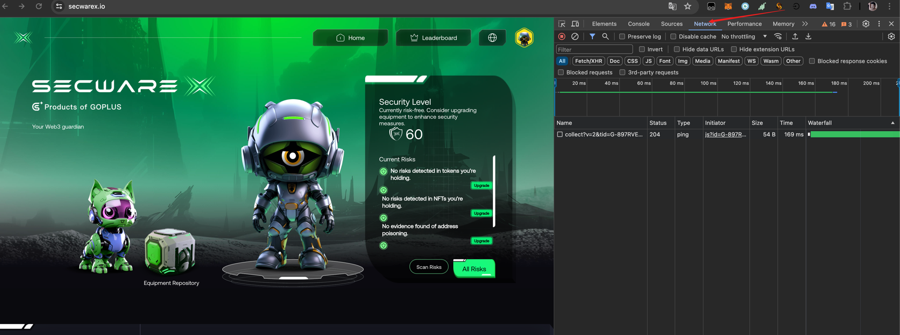
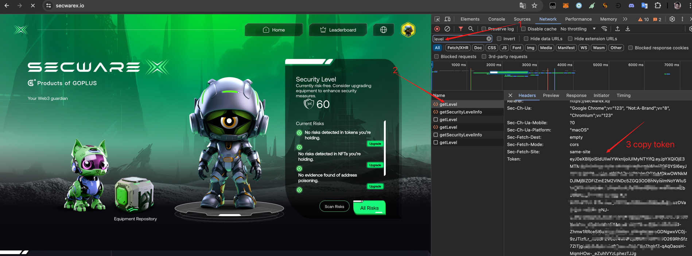

# A Script for daily scan task of GoPlus SecwareX
Auto check in for SecWareX by retrieving token information manually. The token lifetime is five days, so you need update your tokens.txt file in each five days.

## How to use
+ add your wallet addresses in addresses.txt
+ add your tokens in tokens.txt
+ execute command ```pip install requests```
+ execute ```python main.py```

## How to retrieve tokens from website
1. In SecwareX page, press **F12** to open console and then check to **network** tab.

2. Refresh page to get network requests. Type *level* to filter network requests.
3. Select the network request named *getLevel*.
4. You can see there is a filed named token in the headers tab
